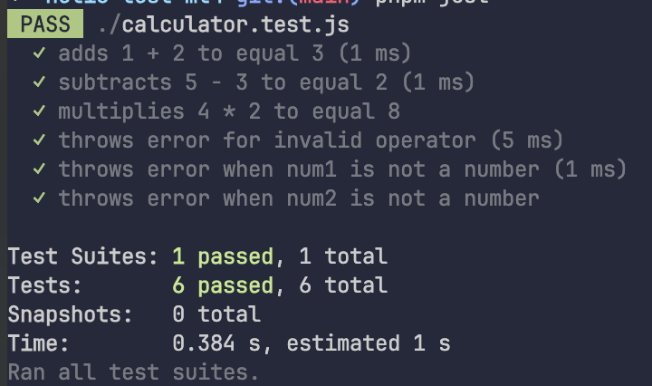

# Projet Calculatrice RPN

Ce projet implémente une calculatrice en notation polonaise inversée (RPN) en utilisant JavaScript. Le projet comprend deux fichiers principaux : `calculator.js` et `calculator.test.js`.

## calculator.js

Le fichier `calculator.js` contient la fonction `rpnCalculator` qui prend trois arguments : `num1`, `num2` et `operator`. Cette fonction effectue des opérations arithmétiques de base (addition, soustraction et multiplication) en fonction de l'opérateur fourni.

### Fonctionnalités

- **Validation des entrées** : La fonction vérifie que `num1` et `num2` sont des nombres. Si ce n'est pas le cas, elle lance une erreur avec le message "num1 and num2 must be numbers".
- **Opérations supportées** :
  - Addition (`+`) : Retourne la somme de `num1` et `num2`.
  - Soustraction (`-`) : Retourne la différence entre `num1` et `num2`.
  - Multiplication (`*`) : Retourne le produit de `num1` et `num2`.
- **Gestion des erreurs** : Si l'opérateur fourni n'est pas valide, la fonction lance une erreur avec le message "Invalid operator".

### Test Coverage

